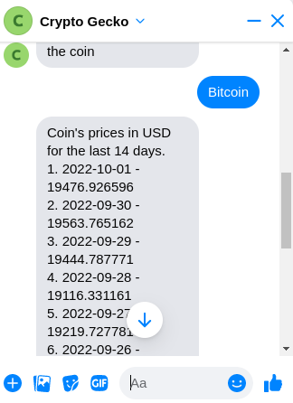

# CoinMaster

Help investors evaluate cryptocurrencies using facebook messenger chatbot.

## Features
1. Welcome the user by using their first name.
2. Ask the user if they want to search coins by name or by ID (Coins ID).
3. Use CoinGecko API to search coins.
4. Retrieve a maximum of 5 coins and let the user select one of them.
5. Retrieve the selected coin’s prices in USD for the last 14 days from CoinGecko.
(get it from market chart)

## Setup
- [Local Setup](/docs/local_setup.md)
- [Production Release](/docs/production_release.md)
- [Facebook messenger configuration](/docs/facebook_messenger_configuration.md)

## Screenshots

</img>
</img>
</img>
</img>
</img>
</img>

